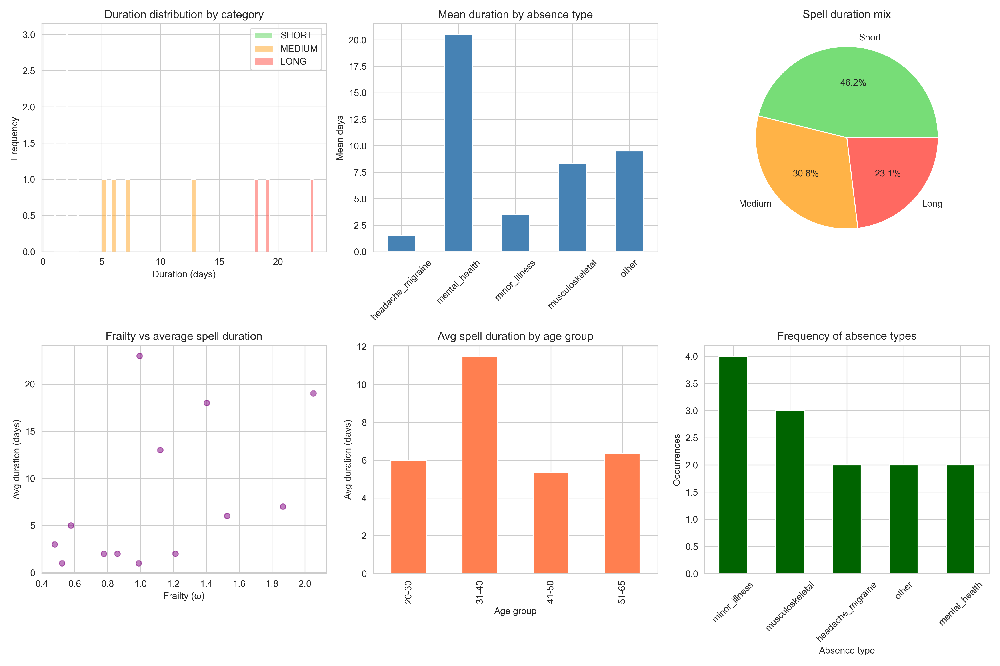

# optimal_line

Repo for Serge's production line problem. The idea is to evaluate the risk of operation line failure due to sickness or accident with limited staff but more trained.


Stage 1:
For the simulation model: see [chat](https://poe.com/s/S8Oc1si01knpwlOyjmJv)
For the config and demo: see [chat](https://poe.com/s/LvXLxCDHQhLU8moXt5pg)




## Installation

```
https://github.com/journeadrien/optimal_line.git
cd optimal_line
pip insall -e .
python scripts
```

```
python scripts/generate_random_data.py --profile risky
```

✅  Generated 8 operations & 15 employees (buffer=1) in data/random
```

python scripts/line_robutness.py 
```

✅  Line operational 225/250 days  (90.0%)


Stage 2:
Given an operation line, find the minimum operator to have the probality of failure under a percentage.

Stage 3:
Given an operation line with assign worker, find the best training program to reduce the failure at maximum.

## Format
